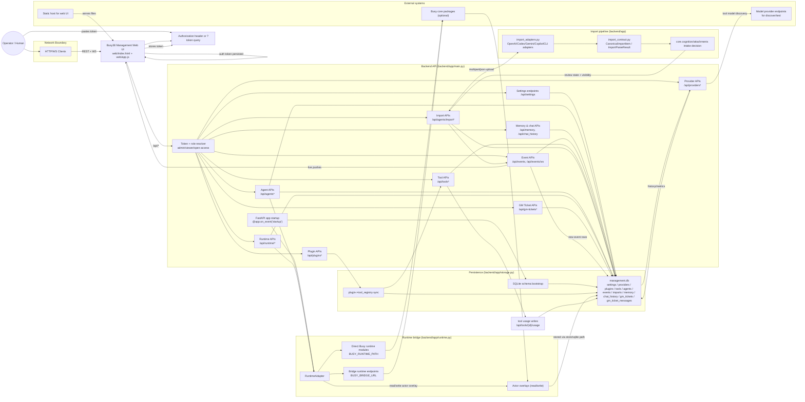
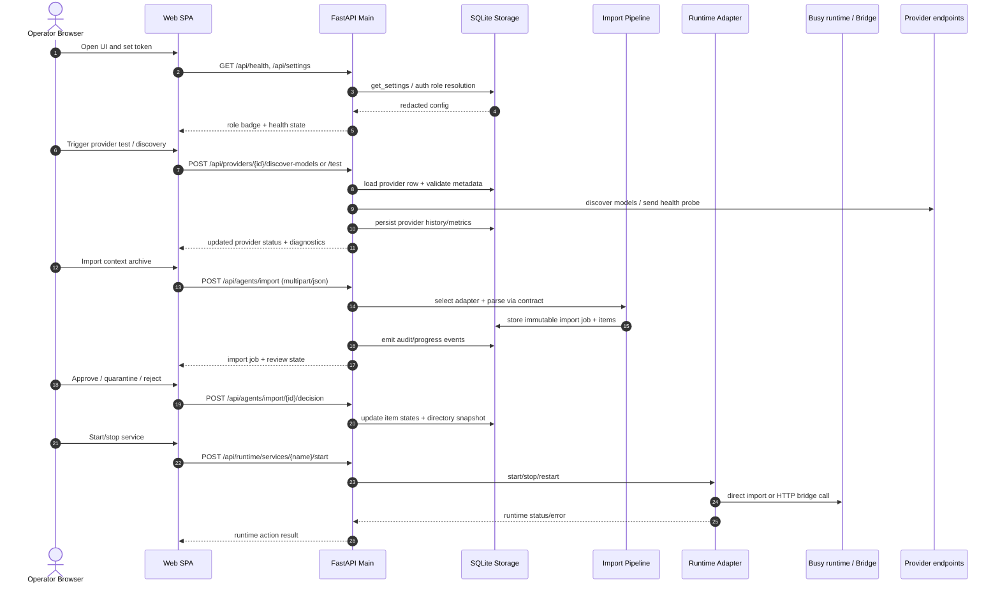

# Busy38 Management UI Architecture

## Mermaid architecture diagram

## Runtime flow map

## Notes

- Default API contract is defined in `main.py`.
- Persistence lives in a single SQLite file configured via `MANAGEMENT_DB_PATH`.
- Runtime control is best-effort in both paths:
  - direct core import when `BUSY_RUNTIME_PATH` is present
  - bridge mode when `BUSY_BRIDGE_URL` is configured
- Import processing is contract-first:
  canonical dataclasses -> sensitivity + visibility + review state -> storage + events.
